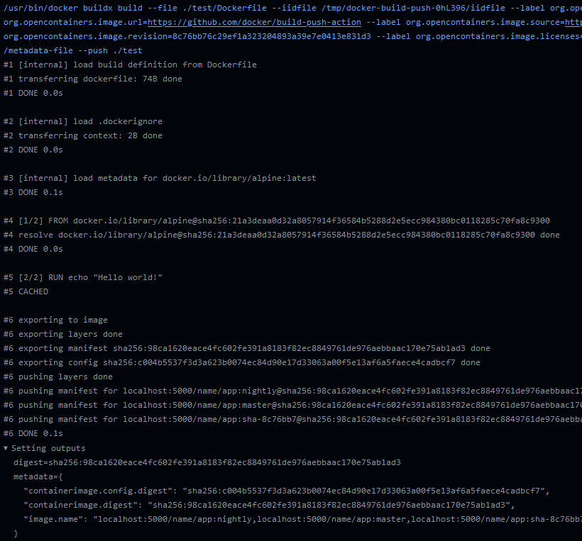

[](https://github.com/docker/build-push-action/releases/latest)
[](https://github.com/marketplace/actions/docker-build-push-images)
[](https://github.com/docker/build-push-action/actions?workflow=ci)
[](https://github.com/docker/build-push-action/actions?workflow=test)

## About

GitHub Action to build and push Docker images.

> :bulb: See also our [setup-buildx](https://github.com/docker/setup-buildx-action)
> and [setup-qemu](https://github.com/docker/setup-qemu-action) actions



___

* [Usage](#usage)
  * [Quick start](#quick-start)
  * [Multi-platform image](#multi-platform-image)
  * [Git context](#git-context)
  * [Complete workflow](#complete-workflow)
* [Customizing](#customizing)
  * [inputs](#inputs)
  * [outputs](#outputs)
  * [environment variables](#environment-variables)
* [Keep up-to-date with GitHub Dependabot](#keep-up-to-date-with-github-dependabot)
* [Limitation](#limitation)

## Usage

This action uses our [setup-buildx](https://github.com/docker/setup-buildx-action) action that extends the
`docker build` command named [buildx](https://github.com/docker/buildx) with the full support of the features
provided by [Moby BuildKit](https://github.com/moby/buildkit) builder toolkit. This includes multi-arch build,
build-secrets, remote cache, etc. and different builder deployment/namespacing options.

### Quick start

```yaml
name: ci

on:
  push:
    branches: master

jobs:
  main:
    runs-on: ubuntu-latest
    steps:
      -
        name: Checkout
        uses: actions/checkout@v2
      -
        name: Set up QEMU
        uses: docker/setup-qemu-action@v1
        with:
          platforms: all
      -
        name: Set up Docker Buildx
        id: buildx
        uses: docker/setup-buildx-action@v1
      -
        name: Login to DockerHub
        uses: crazy-max/ghaction-docker-login@v1 
        with:
          username: ${{ secrets.DOCKER_USERNAME }}
          password: ${{ secrets.DOCKER_PASSWORD }}
      -
        name: Build and push
        id: docker_build
        uses: docker/build-push-action@v2
        with:
          builder: ${{ steps.buildx.outputs.name }}
          push: true
          tags: user/app:latest
      -
        name: Image digest
        run: echo ${{ steps.docker_build.outputs.digest }}
```

### Multi-platform image

```yaml
name: ci

on:
  push:
    branches: master

jobs:
  multi:
    runs-on: ubuntu-latest
    steps:
      -
        name: Checkout
        uses: actions/checkout@v2
      -
        name: Set up QEMU
        uses: docker/setup-qemu-action@v1
        with:
          platforms: all
      -
        name: Set up Docker Buildx
        id: buildx
        uses: docker/setup-buildx-action@v1
      -
        name: Login to DockerHub
        uses: crazy-max/ghaction-docker-login@v1 
        with:
          username: ${{ secrets.DOCKER_USERNAME }}
          password: ${{ secrets.DOCKER_PASSWORD }}
      -
        name: Build and push
        uses: docker/build-push-action@v2
        with:
          builder: ${{ steps.buildx.outputs.name }}
          context: .
          file: ./Dockerfile
          platforms: linux/amd64,linux/arm64,linux/386
          push: true
          tags: |
            user/app:latest
            user/app:1.0.0
```

### Git context

You can build from Git directly without [`actions/checkout`](https://github.com/actions/checkout/) action,
even in private repositories if your `context` is a valid Git url:

```yaml
name: ci

on:
  push:
    branches: master

jobs:
  git-context:
    runs-on: ubuntu-latest
    steps:
      -
        name: Set up QEMU
        uses: docker/setup-qemu-action@v1
        with:
          platforms: all
      -
        name: Set up Docker Buildx
        id: buildx
        uses: docker/setup-buildx-action@v1
        with:
          version: latest
      -
        name: Login to DockerHub
        uses: crazy-max/ghaction-docker-login@v1
        with:
          username: ${{ secrets.DOCKER_USERNAME }}
          password: ${{ secrets.DOCKER_PASSWORD }}
      -
        name: Build and push
        uses: docker/build-push-action@v2
        with:
          builder: ${{ steps.buildx.outputs.name }}
          context: "${{ github.repositoryUrl }}#${{ github.ref }}"
          platforms: linux/amd64,linux/arm64,linux/386
          push: true
          tags: |
            name/app:latest
            name/app:1.0.0
        env:
          GIT_AUTH_TOKEN: ${{ github.token }}
```

### Complete workflow

* On `pull_request` event, Docker image `name/app:edge` is **built**.
* On `push` event, Docker image `name/app:edge` is **built** and **pushed** to DockerHub.
* On `schedule` event, Docker image `name/app:nightly` is **built** and **pushed** to DockerHub.
* On `push tags` event, Docker image `name/app:<version>` and `name/app:latest` is **built** and **pushed** to DockerHub.

```yaml
name: ci

on:
  schedule:
    - cron: '0 10 * * *' # everyday at 10am
  push:
    branches: master
    tags:
      - 'v*.*.*'
  pull_request:
    branches: master

jobs:
  docker:
    runs-on: ubuntu-latest
    steps:
      -
        name: Checkout
        uses: actions/checkout@v2
      -
        name: Prepare
        id: prep
        run: |
          DOCKER_IMAGE=name/app
          VERSION=edge
          if [[ $GITHUB_REF == refs/tags/* ]]; then
            VERSION=${GITHUB_REF#refs/tags/v}
          fi
          if [ "${{ github.event_name }}" = "schedule" ]; then
            VERSION=nightly
          fi
          TAGS="${DOCKER_IMAGE}:${VERSION}"
          if [[ $VERSION =~ ^[0-9]{1,3}\.[0-9]{1,3}\.[0-9]{1,3}$ ]]; then
            TAGS="$TAGS,${DOCKER_IMAGE}:latest"
          fi
          echo ::set-output name=tags::${TAGS}
      -
        name: Set up QEMU
        uses: docker/setup-qemu-action@v1
        with:
          platforms: all
      -
        name: Set up Docker Buildx
        id: buildx
        uses: docker/setup-buildx-action@v1
      -
        name: Login to DockerHub
        if: github.event_name != 'pull_request'
        uses: crazy-max/ghaction-docker-login@v1 
        with:
          username: ${{ secrets.DOCKER_USERNAME }}
          password: ${{ secrets.DOCKER_PASSWORD }}
      -
        name: Build and push
        id: docker_build
        uses: docker/build-push-action@v2
        with:
          builder: ${{ steps.buildx.outputs.name }}
          context: .
          file: ./Dockerfile
          platforms: linux/amd64,linux/arm64,linux/386
          push: ${{ github.event_name != 'pull_request' }}
          tags: ${{ steps.prep.outputs.tags }}
```

## Customizing

### inputs

Following inputs can be used as `step.with` keys

| Name                | Type    | Default                           | Description                        |
|---------------------|---------|-----------------------------------|------------------------------------|
| `builder`           | String  |                                   | Builder instance (see [setup-buildx](https://github.com/docker/setup-buildx-action) action) |
| `context`           | String  | `.`                               | Build's context is the set of files located in the specified [`PATH` or `URL`](https://docs.docker.com/engine/reference/commandline/build/) |
| `file`              | String  | `./Dockerfile`                    | Path to the Dockerfile. |
| `build-args`        | List    |                                   | List of build-time variables |
| `labels`            | List    |                                   | List of metadata for an image |
| `tags`              | List    |                                   | List of tags |
| `pull`              | Bool    | `false`                           | Always attempt to pull a newer version of the image |
| `target`            | String  |                                   | Sets the target stage to build |
| `allow`             | List    |                                   | List of [extra privileged entitlement](https://github.com/docker/buildx#--allowentitlement) (eg. `network.host,security.insecure`) |
| `no-cache`          | Bool    | `false`                           | Do not use cache when building the image |
| `platforms`         | List    |                                   | List of [target platforms](https://github.com/docker/buildx#---platformvaluevalue) for build |
| `load`              | Bool    | `false`                           | [Load](https://github.com/docker/buildx#--load) is a shorthand for `--output=type=docker` |
| `push`              | Bool    | `false`                           | [Push](https://github.com/docker/buildx#--push) is a shorthand for `--output=type=registry` |
| `outputs`           | List    |                                   | List of [output destinations](https://github.com/docker/buildx#-o---outputpath-typetypekeyvalue) (format: `type=local,dest=path`) |
| `cache-from`        | List    |                                   | List of [external cache sources](https://github.com/docker/buildx#--cache-fromnametypetypekeyvalue) (eg. `user/app:cache`, `type=local,src=path/to/dir`) |
| `cache-to`          | List    |                                   | List of [cache export destinations](https://github.com/docker/buildx#--cache-tonametypetypekeyvalue) (eg. `user/app:cache`, `type=local,dest=path/to/dir`) |

> List type can be a comma or newline-delimited string
> ```yaml
> tags: name/app:latest,name/app:1.0.0
> ```
> ```yaml
> tags: |
>   name/app:latest
>   name/app:1.0.0
> ```

### outputs

Following outputs are available

| Name          | Type    | Description                           |
|---------------|---------|---------------------------------------|
| `digest`      | String  | Image content-addressable identifier also called a digest |

### environment variables

Following environment variables can be used as `step.env` keys

| Name                     | Description                           |
|--------------------------|---------------------------------------|
| `GIT_AUTH_HEADER`**¹**   | Raw authorization header to authenticate against git repository |
| `GIT_AUTH_TOKEN`**¹**    | `x-access-token` basic auth to authenticate against git repository |

> **¹** Only used if `input.context` is a valid git uri.

## Keep up-to-date with GitHub Dependabot

Since [Dependabot](https://docs.github.com/en/github/administering-a-repository/keeping-your-actions-up-to-date-with-github-dependabot)
has [native GitHub Actions support](https://docs.github.com/en/github/administering-a-repository/configuration-options-for-dependency-updates#package-ecosystem),
to enable it on your GitHub repo all you need to do is add the `.github/dependabot.yml` file:

```yaml
version: 2
updates:
  # Maintain dependencies for GitHub Actions
  - package-ecosystem: "github-actions"
    directory: "/"
    schedule:
      interval: "daily"
```

## Limitation

This action is only available for Linux [virtual environments](https://help.github.com/en/articles/virtual-environments-for-github-actions#supported-virtual-environments-and-hardware-resources).
